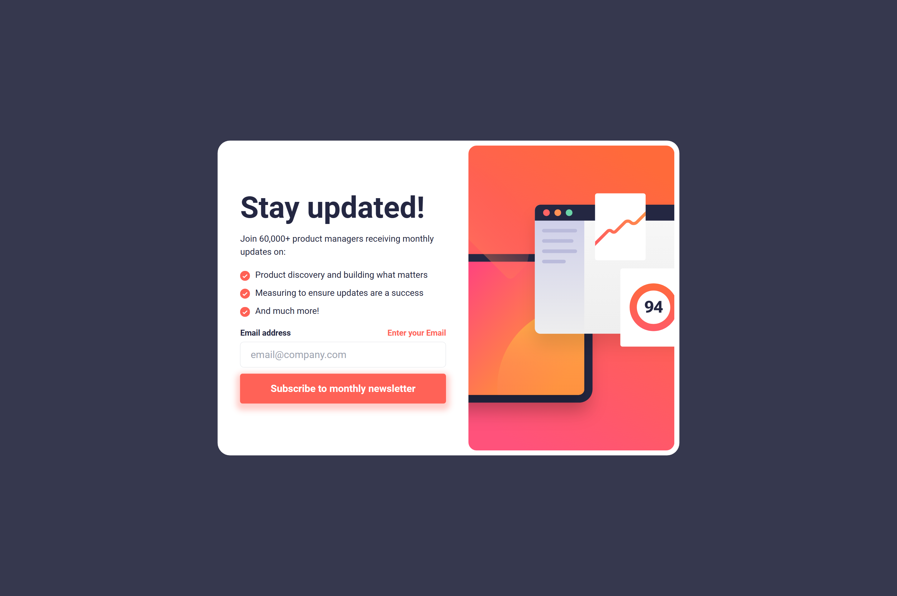
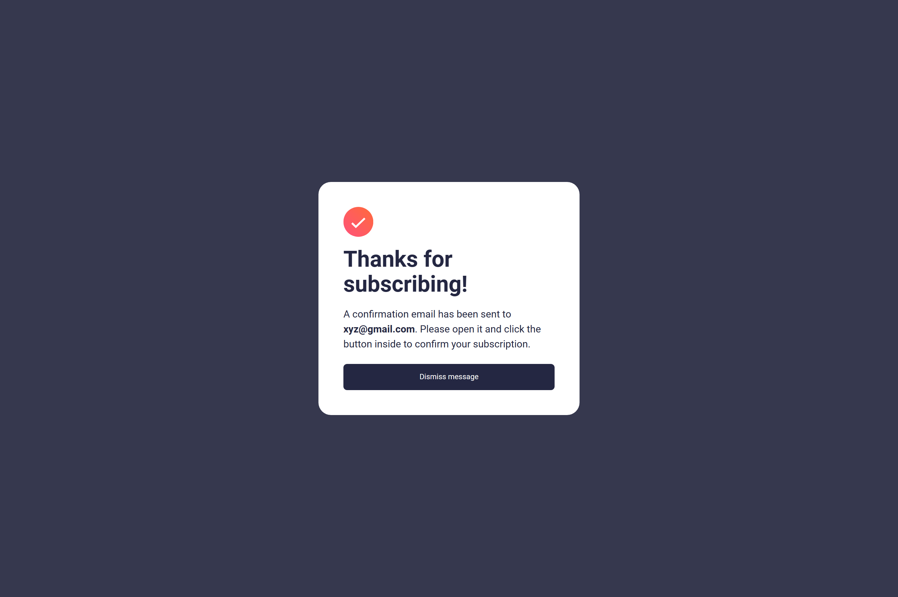

# Frontend Mentor - Newsletter sign-up form with success message solution

This is a solution to the [Newsletter sign-up form with success message challenge on Frontend Mentor](https://www.frontendmentor.io/challenges/newsletter-signup-form-with-success-message-3FC1AZbNrv). Frontend Mentor challenges help you improve your coding skills by building realistic projects.

## Table of contents

- [Overview](#overview)
  - [The challenge](#the-challenge)
  - [Screenshot](#screenshot)
  - [Links](#links)
- [My process](#my-process)
  - [Built with](#built-with)
  - [What I learned](#what-i-learned)
  - [Useful resources](#useful-resources)
- [Author](#author)

## Overview

### The challenge

Users should be able to:

- Add their email and submit the form
- See a success message with their email after successfully submitting the form
- See form validation messages if:
  - The field is left empty
  - The email address is not formatted correctly
- View the optimal layout for the interface depending on their device's screen size
- See hover and focus states for all interactive elements on the page

This project is responsive at screens >

- Desktop XL > 2560px
- Laptop L > 1440px
- Laptop > 1024px
- Tablet > 768px
- Mobile L > 425px
- Mobile M > 375px
- Mobile S > 320px

### Screenshot

**Snapshot at screen width 1440px >** Hover effect on Subscribe button and error message after trying empty input

**Snapshot at screen width 1440px >** Thank you message with dynamic Email. Dismiss Button at non-hover state.

In repository, there are two more snapshots.

**Newsletter-signup-snap-2** > at 1440px - Error message after entering invalid Email input

**Newsletter-signup-snap-4** > at 320px - Thank you message with dynamic Email. Dismiss Button at non-hover state.

### Links

- Solution URL: [Source Code](https://github.com/SoniBasant/Newsletter-signup-with-success-message)

- Live Site URL: [Live Link](https://sonibasant-newsletter-signup.netlify.app/)

## My process

### Built with

- Semantic HTML5 markup
- CSS custom properties
- Flexbox
- Desktop-first workflow
- SessionStorage > set and get method
- **React**
- **Tailwind CSS**
- **React Router**
- **Vite**

### What I learned

I made this project using React so I learn many concepts related to it.

- React
  - Installation
  - Project setup using **Vite**
  - Install **Tailwind** in React
  - Install React **Router**

Other than these configuration I learn many concepts of React >

- Add font files
- Add Image from local
- Image in src folder vs public folder
- Virtual DOM
- State and Props
- React components > Function component

In React Routing I learn these concepts >

- SPA (Single Page Application)
- Routing (Rect Router)
  - Installtion
  - Router
  - path, element
  - Link, Navigation, NavLink

### Useful resources

- [React](https://reactjs.org/) - JS library

- [Tailwind CSS](https://tailwindcss.com/) - For styles
- [React Router](https://reactrouter.com/en/main) - For Client side routing
- [Vite](https://vitejs.dev/) - Build Tool

## Author

Basant Soni 👨‍💻

- GitHub - [@SoniBasant](https://github.com/SoniBasant)

- Frontend Mentor - [@SoniBasant](https://www.frontendmentor.io/profile/SoniBasant)
- CodePen - [@SoniBasant](https://codepen.io/sonibasant)
- Hashnode - [@SoniBasant](https://sonibasant.hashnode.dev/)
